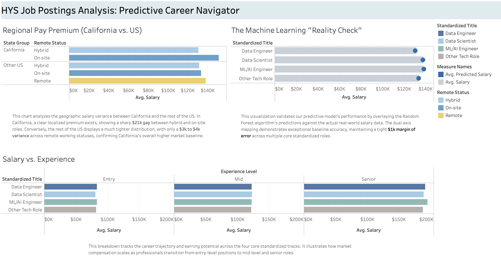

# HYS Job Postings Analysis: Predictive Career Navigator

An end-to-end data pipeline that extracts, cleans, transforms, and analyzes over 9,300 web-scraped tech job postings to uncover regional market trends and predict salary benchmarks using Machine Learning.

## Project Overview
This project was built during the **"[Hack Your Summer](https://www.hackyoursummer.org)"** program. It bridges the gap between cloud data architecture, predictive machine learning modeling, and user-facing business intelligence.

- **Phase 1 (Data Engineering)**: Cloud Data Warehousing & SQL Architecture in Google BigQuery
- **Phase 2 (Data Science)**: Advanced Text Parsing, Feature Engineering, & Random Forest Regression in Python
- **Phase 3 (Business Intelligence)**: UI Dashboard Layout & Interactive Visual Analytics in Tableau

---

## Tech Stack & Skills Demonstrated
- **Data Infrastructure**: Google Cloud Platform (GCP), BigQuery, SQL (CTEs, Case Statements, Conditional Filtering)
- **Machine Learning & Engineering**: Python 3, Pandas, Scikit-Learn, Regular Expressions
- **Analytics & BI**: Tableau Desktop, Advanced Charting (Dual-Axis, Synchronized Mapping, Visual Dashboard Design)

---

## Key Insights & Model Performance

### 1. Geographic Salary Variance (California vs. US Baseline)
- **The California Premium**: SQL and Tableau analysis confirmed a definitive localized salary premium for tech roles based in California, highlighting a sharp **$21k gap** between hybrid and on-site positions.
- **National Landscape**: The rest of the US displayed a significantly tighter distribution, showing a minimal **$3k to $4k variance** across various remote working statuses.

### 2. Predictive Power & Feature Selection
- **The Core Model**: The final ensemble Random Forest Regressor achieved an **R² score of 0.60** and a **Mean Absolute Error (MAE) of ~$24.6k**. This proves that macro features—Job Title, Experience Level, Geography, and Remote Status—account for **60% of the true variance** in tech market salaries.
- **The Noise Penalty Experiment**: An automated feature engineering loop was written to tokenize individual programming languages (e.g., Python, SQL) from job strings. This introduced high collinearity and feature redundancy, dropping the R² score down to **0.51**. This validated that macro job structures hold significantly higher predictive weight than granular tool requirements.

---

## Interactive Tableau Dashboard
The final interactive application brings the machine learning model's outputs to life across three core visual stories:
1. **Salary vs. Experience**: Tracks the career trajectory and earning potential across core standardized tracks (Data Engineer, Data Scientist, ML/AI Engineer, and Other Tech Roles) as they scale from entry to senior bands.
2. **Regional Pay Premium**: Side-by-side comparative rows highlighting exactly how work modes stack up between California and the national market.
3. **The Machine Learning "Reality Check"**: A dual-axis visual validation chart that overlays the dark blue machine learning predictions directly onto the light gray real-world salary baselines, demonstrating a tight **$1k margin of error** across primary roles.


**[Link to view live interactive dashboard on Tableau Public](https://public.tableau.com/views/HYSJobPostingsAnalysis/HYSJobPostingsAnalysis-Dashboard?:language=en-US&:sid=&:redirect=auth&:display_count=n&:origin=viz_share_link)**

---

## Repository Directory Structure
```text
HYS-Job-Postings-Analysis/
│
├── data/
│   └── final_salary_predictions.csv     # Engineered ML outputs used for Tableau
│
├── notebooks/
│   └── salary_prediction_pipeline.ipynb # Google Colab Python/Scikit-Learn modeling
│
├── SQL/
│   └── bigquery_cleaning_queries.sql    # BigQuery warehouse extraction & cleaning scripts
│
└── README.md                            # Project documentation


## Data Sources
- **Processed Dataset**: The final engineered output containing the model's rounded predictions is located in the `data/` directory.
- **Original Source**: The raw web-scraped AI & Data job postings dataset can be found on [Kaggle](https://www.kaggle.com/datasets/m0sm71/ai-jobs-dataset-2026).
